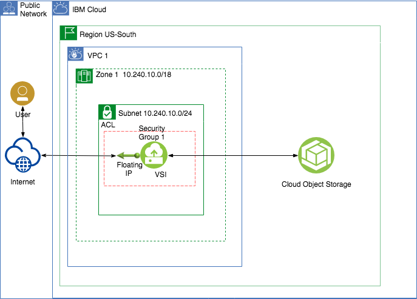

# Use GUI, CLI or API to Connect an App deployed within VPC to Cloud Object Storage (COS) using a private endpoint.

### Purpose
This scenario illustrates how an application deployed within a VPC can use IBM Cloud Object Storage.

The example shown in this scenario includes a Node.js application *(MyCOS)* which saves records to an IBM Cloud Object Storage bucket.

After completing the scenario you will be able to:
- Create Virtual Private Clouds using the IBM Cloud console (UI), Command Line Interface (CLI), or Application Programming Interface (API).
- Create Linux Virtual Servers in a Virtual Private Cloud
- Connect to and execute commands in a linux Virtual Server
- Configure a Node.js application to use an existing IBM Cloud Object Storage service.
- Save data into a Cloud Object Storage bucket

#### The MyCOS sample application
This scenario includes a small Node.js application called MyCOS. This Node.js application saves data into IBM Cloud Object Storage.

The MyCOS application will perform the following actions:
1. Connect to IBM Cloud Object Storage
2. List the buckets that are in the COS
3. Create a new record in COS

MyCOS uses the [IBM Cloud Object Storage SDK](https://github.com/IBM/ibm-cos-sdk-js) to connect to and save data to IBM Cloud Object Storage.

### Architecture


### Prerequisites
1. An IBM Cloud Account
2. Authority to create VPC resources and IBM Cloud Object Storage services in the IBM Cloud Account
3. A provisioned instance of the [IBM Cloud Object Storage service](https://cloud.ibm.com/docs/services/cloud-object-storage?topic=cloud-object-storage-about-ibm-cloud-object-storage#about-ibm-cloud-object-storage)
4. IBM Cloud Object Storage service credentials with a private endpoint. [Generating Cloud Object Storage credentials](https://cloud.ibm.com/docs/services/cloud-object-storage/iam?topic=cloud-object-storage-service-credentials#service-credentials)
7. ssh-keygen installed locally.

### Deploy VPC infratrsucture
The instructions to deploy the VPC infrastructure for this scenario are available in these flavors:
1. [Using the IBM Cloud CLI](https://github.ibm.com/customer-success/ibmcloud/blob/master/VPC_Phase1/Integrate_Services/integrate17/README-cli.md)
2. [Using the IBM Console UI](https://github.ibm.com/customer-success/ibmcloud/blob/master/VPC_Phase1/Integrate_Services/integrate17/README-console.md)
3. [Using the IBM Cloud API](https://github.ibm.com/customer-success/ibmcloud/blob/master/VPC_Phase1/Integrate_Services/integrate17/README-api.md)

### Access the VPC's Virtual Server and Install Node.js, NPM and the MyCOS sample application

1. Issue the following command to access the Virtual Server: 
   `ssh -i root@*floating ip*`
    - The *floating ip* is the IP address assigned to the VPC's VSI in the previous section.

   If you need to specify the SSH Key file, use the following command:
   `ssh -i *ssh key file* root@*floating ip*`
    - The *ssh key file* is the full path and filename of the SSH Key file created in Section #2 above.

2. Update the local package repository. Issue the command 
   `apt update`
3. Install Node.js and NPM by issuing the following commands:
    - `curl -sL https://deb.nodesource.com/setup_10.x | sudo bash -`
    - `apt install nodejs`
4. Verify the installation is complete by issuing the command `node --version`. You should see a valid version of Node returned that is greater than or equal to 10.15.0

5. Create a new directory called 'myCOS' and change to that directory by issuing these commands:
    - `mkdir myCOS`
    - `cd myCOS`

6. Create the package.json file by issuing the command `vi package.json`
7. Copy the following code to your clipboard: 
```
   {
      "name": "mycos",
      "version": "0.0.1",
      "private": true,
      "scripts": {
         "start": "node main.js"
      },
      "dependencies": {
         "ibm-cos-sdk": "^1.4.1"
      },
      "repository": {},
      "engines": {
         "node": "6.x"
      }
   }
```

8. Paste the code above into the VI editor
   *Hint: In VI, press the 'a' key to start appending text and then paste the text*
9. Save and exit the file
   *Hint: in VI, press the Colon key and then type wq! and press enter*
10. Create the main.js file by issuing the command `vi main.js`
11. Copy and paste the entire main.js source file into the vi editor. [Open the main.js file](myCOS/main.js)
12. Using your COS service credentials, edit the following variables in the main.js source code:
   - apiKeyId: Set this value to the api-key in your credentials
   - serviceInstanceId: Set this value to the resource-instance-id in your credentials
   - endPoint: Set the endpoint based on the COS direct endpoint [documented here](https://cloud.ibm.com/docs/vpc?topic=vpc-connecting-vpc-cos#cos-direct-endpoints-for-use-with-vpc)
13. Set the bucketName variable to the name of a bucket in your COS that myCOS can insert data into
14. Save and exit the file
15. Issue the command `npm update`
16. Start the application by issuing the command `npm start`
  
## Links
- [IBM Cloud Object Storage](https://cloud.ibm.com/docs/services/cloud-object-storage?topic=cloud-object-storage-about-ibm-cloud-object-storage#about-ibm-cloud-object-storage)
- [Connecting to IBM Cloud Object Storage from VPC](https://cloud.ibm.com/docs/vpc?topic=vpc-connecting-vpc-cos#cos-direct-endpoints-for-use-with-vpc)
- [IBM Cloud VPC](https://cloud.ibm.com/docs/vpc-on-classic?topic=vpc-on-classic-getting-started)
- [Using Node.js with IBM Cloud Object Storage](https://cloud.ibm.com/docs/services/cloud-object-storage/libraries?topic=cloud-object-storage-node#using-node-js)